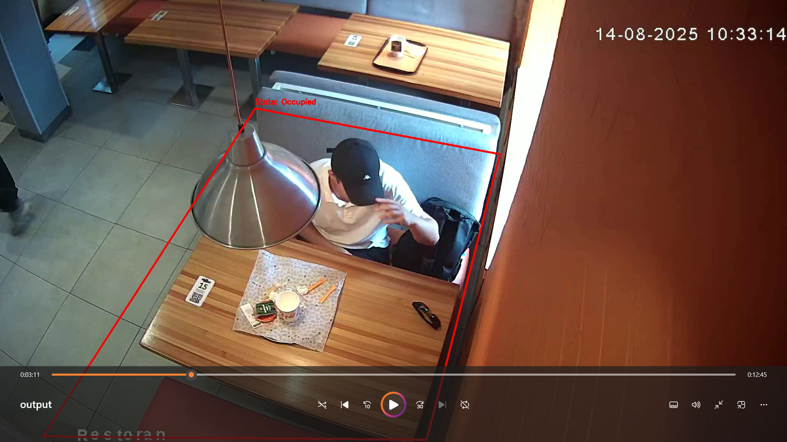
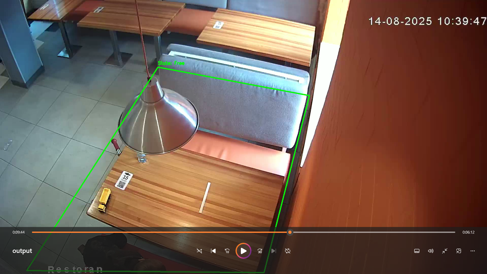

# Dodo Pizza — Детекция занятости столика

Проект анализирует видеозапись с камеры в пиццерии и определяет, когда столик занят, свободен, и когда к нему подходит человек. На основе событий рассчитывается **среднее время между уходом гостя и подходом следующего**.

## Загрузка


## Запуск

1. Создать и активировать виртуальное окружение:
   ```bash
   python -m venv venv
   source venv/bin/activate # Для Linux/MacOS
   ./venv/Scripts/Activate.ps1 # Для Windows
   ```
2. Установить зависимости:
   ```bash
   pip install -r requirements.txt
   ```
3. Запустить скрипт:
   ```bash
   python main.py --video video2.mp4
   ```
   При запуске откроется первый кадр видео — необходимо выделить область столика по часовой стрелке 4-мя точками (ЛКМ), затем нажать **Enter**.

## Выбранное видео и столик

- **Видео:** `video2.mp4`
- **Столик:** выбрал столик в правом нижнем углу.

## Логика детекции событий

1. **Детекция людей** — YOLOv8n (`yolov8n.pt`) детектирует людей (класс `person`) на каждом кадре.
2. **Проверка нахождения в зоне** — так как ракурс не позволяет выбрать ровный прямоугольник ('cv2.selectROI' позволяет выбрать только прямоугольник), поэтому я выбрал для реализации полигон (`cv2.pointPolygonTest`). Для каждого обнаруженного человека вычисляется центр bounding box и проверяется, попадает ли он внутрь выбранного полигона (выбранный полигон — это прямоугольник, в котором находится столик). Чтобы выбрать полигон, надо добавить 4 точки по часовой стрелке, нажимая **ЛКМ**, затем нажать **Enter**.
3. **Буфер стабилизации** — результаты (есть/нет человек) накапливаются в скользящем буфере из 16 кадров. Столик считается занятым, если ≥ 50% кадров в буфере показывают присутствие человека.
4. **Подход** — фиксируется, когда буфер начинает заполняться после пустого состояния (переход от ≤5 положительных кадров к росту).
5. **Уход** — если буфер перестаёт показывать стабильную занятость, запускается таймер ожидания **7 секунд**. Если за это время человек не вернулся — столик считается свободным (время события компенсируется на время ожидания).
6. **Результат** — для каждого «Занято» находится ближайшее предшествующее событие «Свободно», разница между ними — время задержки. Итог — среднее по всем таким парам.

## Результат

Для `video2.mp4`:

| Метрика | Значение |
|---|---|
| Среднее время между уходом и подходом | **196 с** |
| Количество зафиксированных подходов | 2 |

Полный лог событий — [events.csv](events.csv), отчёт — [report.txt](report.txt).

## Задержка

Задержка видео: -36.65 мс/кадр

Чтобы уменьшить задержку, можно:

1. Выполнять детекцию каждый N кадр
2. Уменьшить размер изображения
3. Взять модель полегче

## Пример проблемного кадра

Ниже — 2 проблемных кадра, на котором модель может ошибаться:
1. На первом кадре перестает детектировать человека, когда он прячется за лампой. Для решения это проблемы реализовал режим ожидания перед сменой состояния
2. На втором кадре проблема из-за ракурса


